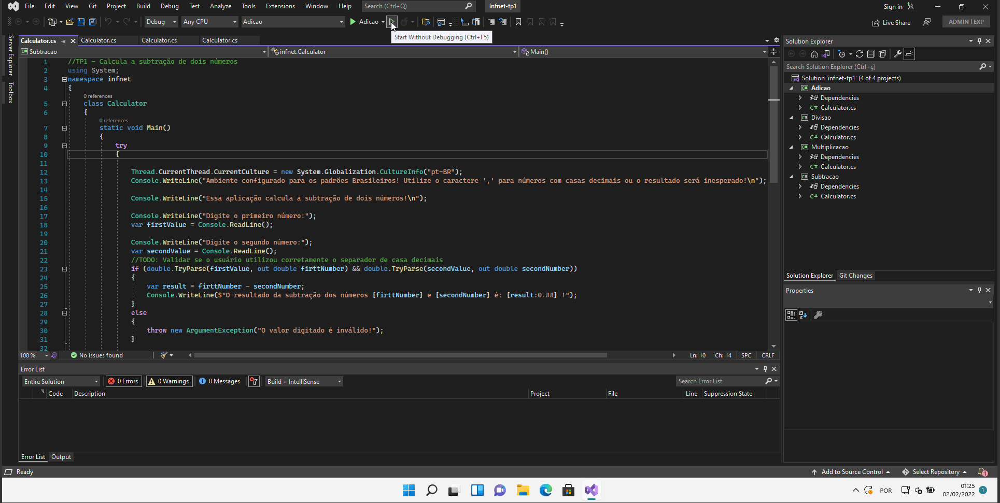
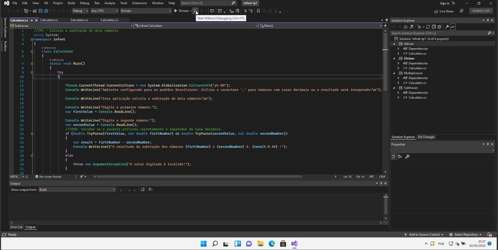
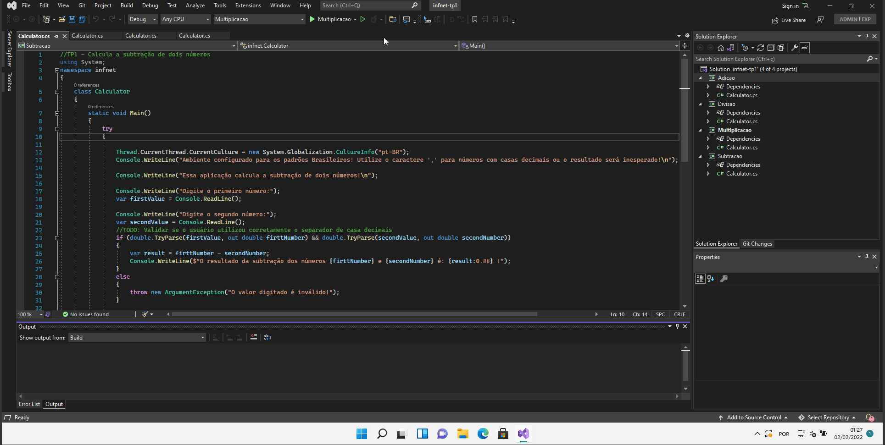
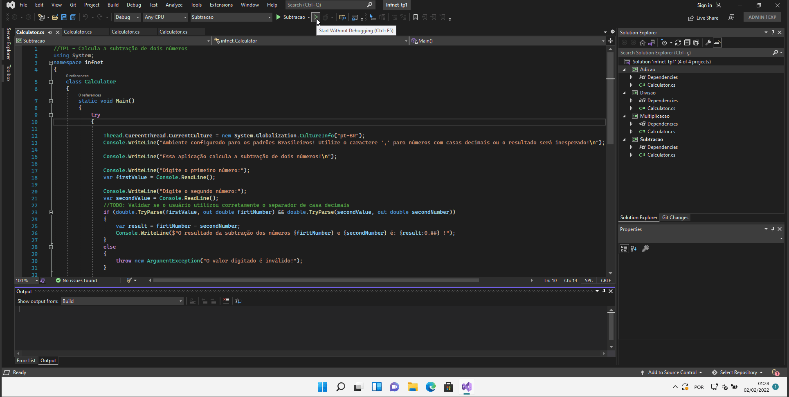

## Fundamentos de Desenvolvimento com C# - TP01

[Teste de Performance 01](https://lms.infnet.edu.br/moodle/mod/assign/view.php?id=276162)

- Exemplo de execução da operação de Adição:

- Exemplo de execução da operação de Divisão:

- Exemplo de execução da operação de Multiplicação:

- Exemplo de execução da operação de Subtração:

