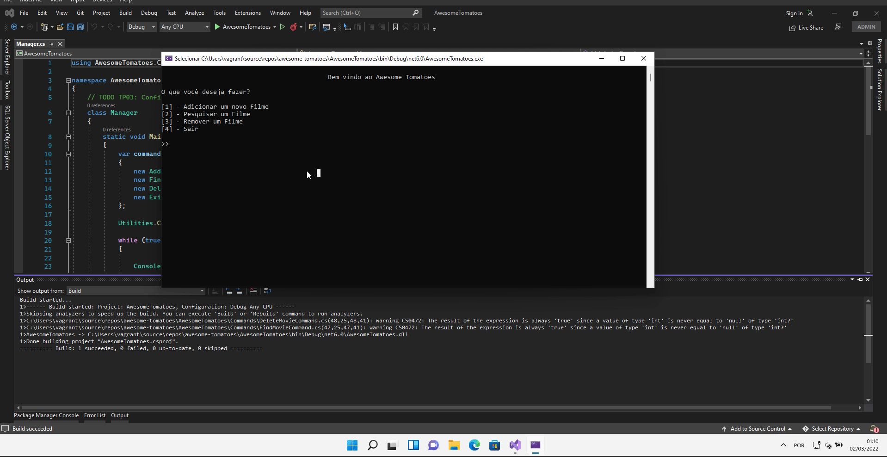

### Fundamentos de Desenvolvimento com C# - TP02

[Teste de Performance 02](https://lms.infnet.edu.br/moodle/mod/assign/view.php?id=276175)

### Sobre a Aplicação Awesome Tomatoes

Essa aplicação foi inspirada no Rotten Tomatoes que é um website americano, agregador de críticas de cinema e televisão. O objetivo do Awesome Tomatoes é implementar
o tema do projeto de bloco que nesse caso é um agregador de reviews ( filmes, séries, etc).

### Exemplo de Execução da Aplicação:

### Funcionalidades Implementadas até o Momento

 - Adicionar um novo Filme
 - Pesquisar um filme
 - Remover um filme 

### Entidades Mapeadas até o Momento

 - Movies

### Dependências

 - Microsoft.EntityFrameworkCore.SqlServer (6.0.2)
 - Microsoft.EntityFrameworkCore.Tools (6.0.2)
 - Colorful.Console (1.2.15)

### Padrões de Projeto Utilizados

 - Command
 - Repository 
