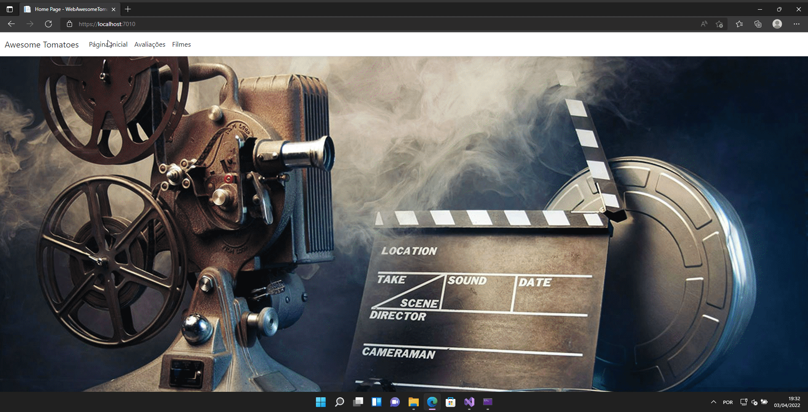

## Fundamentos do Desenvolvimento de Aplicações Web ASP .NET - Assessment

[Assessment](https://lms.infnet.edu.br/moodle/mod/assign/view.php?id=276024)

### Status

### Sobre a Aplicação Awesome Tomatoes

Essa aplicação foi inspirada no Rotten Tomatoes que é um website americano, agregador de críticas de cinema e televisão. O objetivo do Awesome Tomatoes é implementar
o tema do projeto de bloco que nesse caso é um agregador de reviews ( filmes, séries, etc).

### Exemplo de Execução da Aplicação

