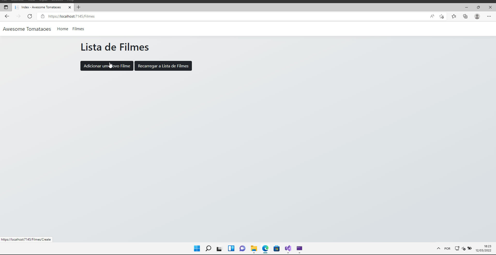
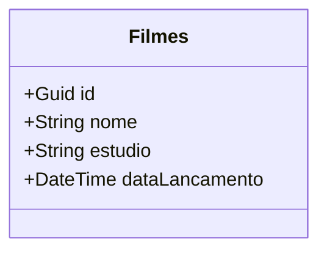

## Fundamentos do Desenvolvimento de Aplicações Web ASP .NET - TP03

[Teste de Performance 03](https://lms.infnet.edu.br/moodle/mod/assign/view.php?id=276125)

### Status

### Sobre a Aplicação Awesome Tomatoes

Essa aplicação foi inspirada no Rotten Tomatoes que é um website americano, agregador de críticas de cinema e televisão. O objetivo do Awesome Tomatoes é implementar
o tema do projeto de bloco que nesse caso é um agregador de reviews ( filmes, séries, etc).

### Exemplo de Execução da Aplicação

### Funcionalidades Implementadas até o Momento

 - Listar todos os Filmes
 - Adicionar um novo Filme
 - Atualizar Filme
 - Vistualizar Detalhes do Filme
 - Remover Filme
 - Pesquisar Filme

### Entidades Mapeadas até o Momento

### Padrões de Projeto Utilizados

 - Repository