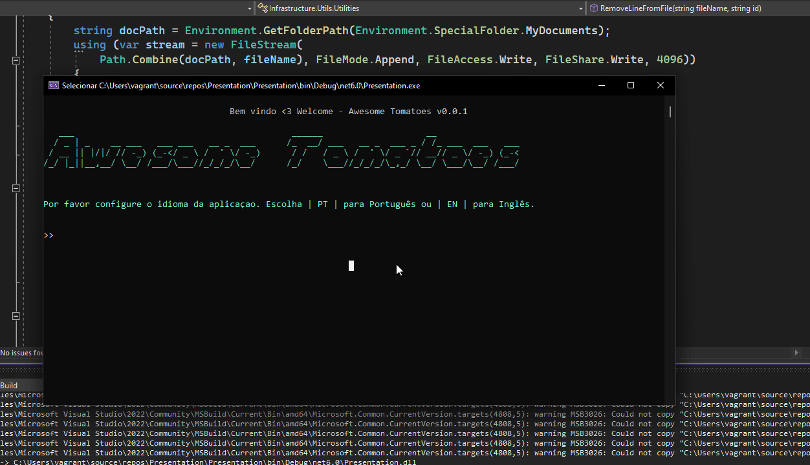
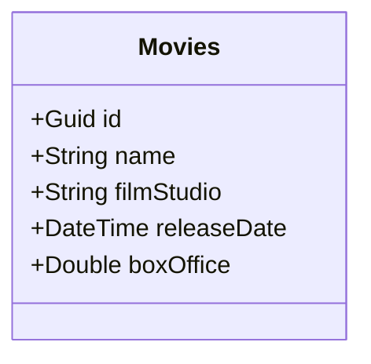
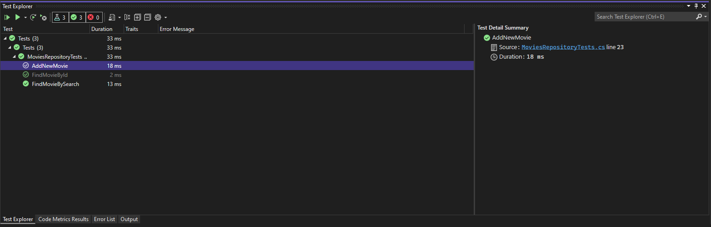

## Fundamentos de Desenvolvimento com C# - TP04

[Teste de Performance 04](https://lms.infnet.edu.br/moodle/mod/assign/view.php?id=276201)

### Status

### Sobre a Aplicação Awesome Tomatoes

Essa aplicação foi inspirada no Rotten Tomatoes que é um website americano, agregador de críticas de cinema e televisão. O objetivo do Awesome Tomatoes é implementar
o tema do projeto de bloco que nesse caso é um agregador de reviews ( filmes, séries, etc).

### Internacionalização

Atualmente a aplicação suporta dois idiomas: PT (Português) e EN (Inglês).

### Exemplo de Execução da Aplicação

Nesse momento a aplicação suporta 3 tipos de "Banco de Dados": Arquivos, List e LinkedList, bastando o usuário escolher ao iniciar a aplicação.

### Funcionalidades Implementadas até o Momento

 - Adicionar um novo Filme
 - Listar todos os Filmes
 - Listar detalhes de um Filme
 - Remover um Filme

### Entidades Mapeadas até o Momento

### Teste Unitário

NUnit está sendo utilizado para execução de testes unitários.

### Dependências

 - Colorful.Console (1.2.15)
 - NUnit (3.3.12)

### Padrões de Projeto Utilizados

 - Command
 - Repository
