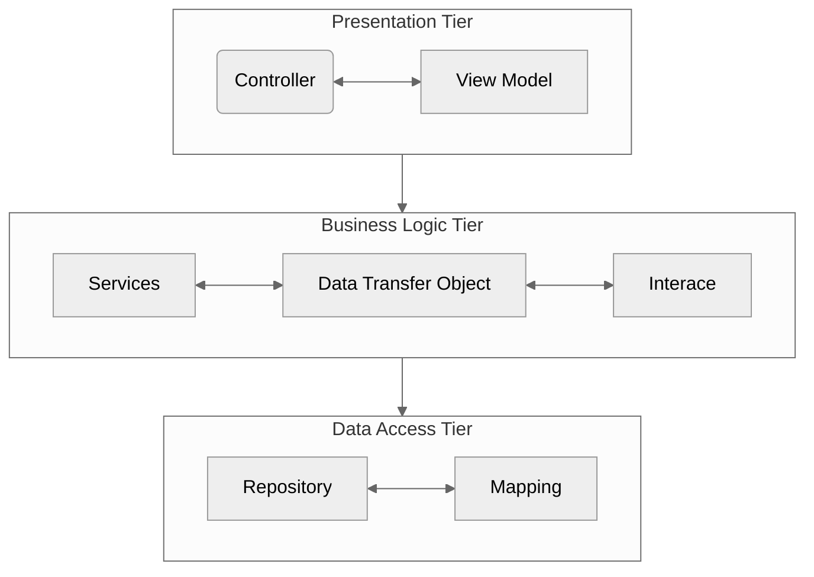

## Projeto de Bloco: Desenvolvimento .NET - TP04 e TP05

[Teste de Performance 04](https://lms.infnet.edu.br/moodle/mod/assign/view.php?id=275913)

[Teste de Performance 05](https://lms.infnet.edu.br/moodle/mod/assign/view.php?id=275921)

### Diagrama de Camadas

