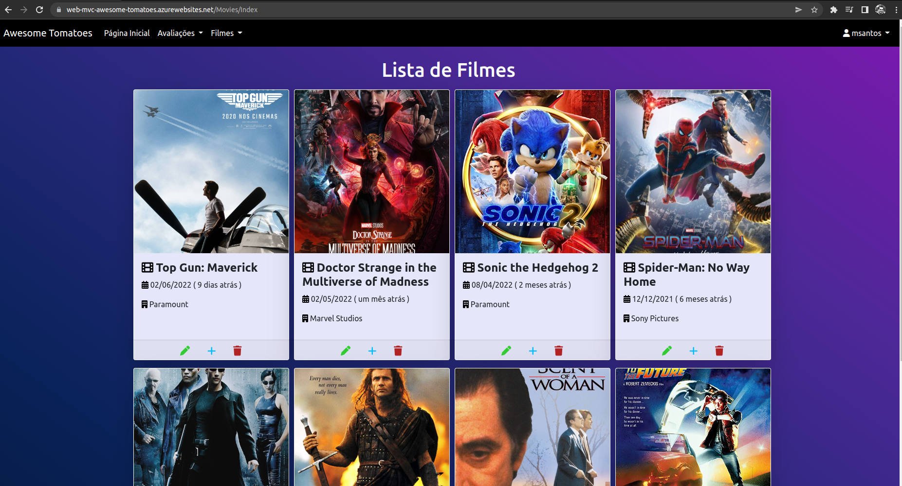

## Desenvolvimento com Serviços WCF e Microsoft Azure - Assessment

[AT](https://lms.infnet.edu.br/moodle/mod/assign/view.php?id=276086)

### Function e Queue

Na página de detalhe estão implementados dois campos referentes ao uso da Azure Functions. O campo "Último Acesso Síncrono" na página de detalhes do filme se refere a execução da Function1 e o campo "Último Acesso Assíncrono" se refere a execução da Queue Function2.

### Aplicação na Azure

[Awesome Tomatoes](https://web-mvc-awesome-tomatoes.azurewebsites.net/)

* **username:** mmagnani
* **password:** RedHat@2022

